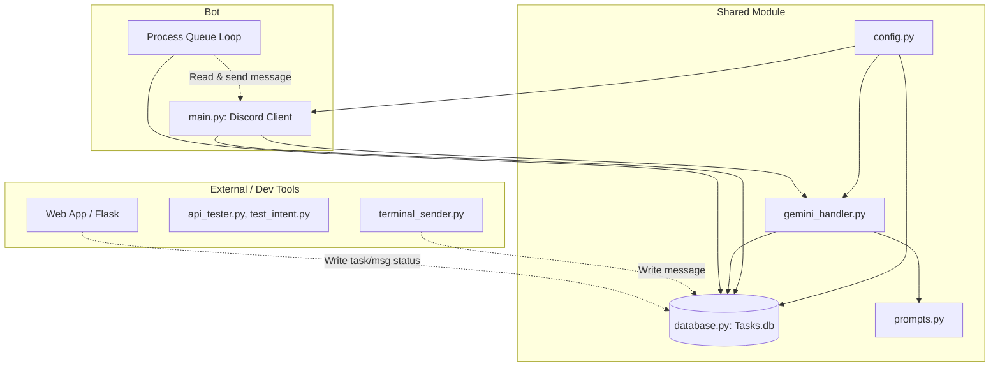
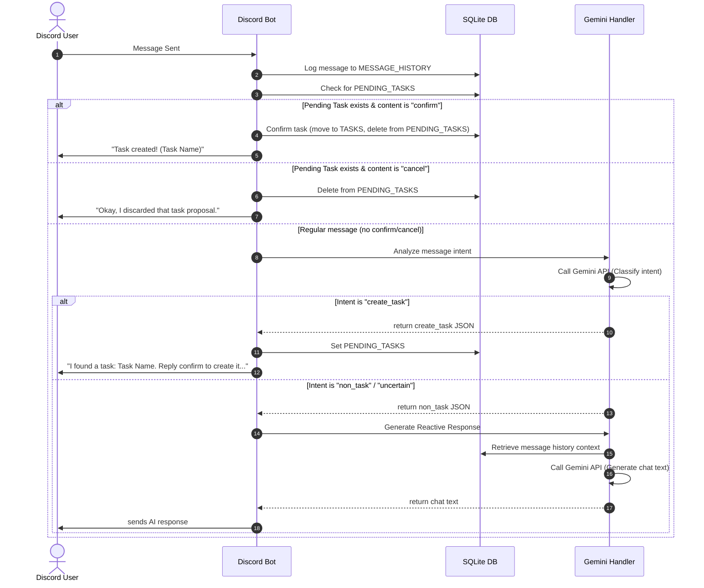

# Tasky: System Walkthrough & Architecture Guide

Welcome to the **Tasky** codebase! This guide is designed to help you quickly understand the system's architecture, database design, LLM integration, and execution flows. By the end of this document, you should feel comfortable navigating the modules and building features on top of Tasky.

---

## 🗺️ Architectural Overview

Tasky is an asynchronous Discord accountability bot that interacts with users in direct messages, classifications/processes tasks in natural language, and maintains a clean boundary between front-facing layers and shared data libraries.

Here is the high-level dependency and integration chart:



### Key Components
1. **Config ([src/shared/config.py](*/Tasky/src/shared/config.py))**: Centralizes application constants, directory setup (`data/`, `logs/`), and environment variable validation (`TOKEN`, `GEMINI_API_KEY`). It enforces failsafes, exiting immediately if environment variables are missing.
2. **Database ([src/shared/database.py](*/Tasky/src/shared/database.py))**: Handles non-blocking database queries via `aiosqlite`.
3. **Prompts ([src/shared/prompts.py](*/Tasky/src/shared/prompts.py))**: Stores LLM personas and prompt templates for bot behavior.
4. **Gemini Handler ([src/shared/gemini_handler.py](*/Tasky/src/shared/gemini_handler.py))**: Integrates the Google GenAI SDK to handle intent classification and conversation responses using Gemini.
5. **Discord Client ([src/bot/main.py](*/Tasky/src/bot/main.py))**: Implements the Discord message event loop and coordinates interaction flows.
6. **Tester Tools (`src/tester_tools/`)**: Standalone scripts to test Gemini API connectivity (`api_tester.py`), classification accuracy (`test_intent.py`), or inject proactive messages into the queue (`terminal_sender.py`).

---

## 💾 Database Design & Concurrency Strategy

SQLite is traditionally a single-process database. However, Tasky is designed to coexist with external dashboards (e.g., Flask or Django apps). We handle this concurrently and safely using:

1. **Write-Ahead Logging (WAL) Mode**: By default, SQLite locks the entire database when writing. In WAL mode, writes are written to a separate `.db-wal` log file while reads continue concurrently from the primary database file. Reading and writing can occur simultaneously.
2. **Synchronous Mode (Normal)**: Instructs SQLite to sync changes less aggressively to disk, saving CPU/IO overhead while maintaining data safety inside WAL.
3. **Busy Timeout**: Configured to `5000ms`. If the database is locked, rather than immediately failing, the query waits up to 5 seconds for the lock to clear.

These operations are executed asynchronously during DB initialization:
```python
await db.execute("PRAGMA journal_mode=WAL;")
await db.execute("PRAGMA synchronous=NORMAL;")
await db.execute("PRAGMA busy_timeout=5000;")
```

### Table Schemas

There are 4 main tables in `Tasks.db`:

*   **`TASKS`**: Confirmed tasks belonging to users.
    *   `id` (INTEGER, PK): Unique task ID.
    *   `author_id` (INTEGER): The Discord User ID.
    *   `head` (TEXT): A short descriptive title.
    *   `body` (TEXT): In-depth task details.
    *   `timestamp` (TEXT): Creation ISO timestamp.
    *   `status` (TEXT): Default `'OPEN'`.
    *   `last_updated` (TEXT): Last time modified.
    *   *Constraint*: `UNIQUE(author_id, head)` prevents duplicate tasks with the same title for the same user.
*   **`MESSAGE_HISTORY`**: Logs all channel messages (bot and users) to provide contextual memory to the LLM.
    *   `id` (INTEGER, PK)
    *   `author_id` (INTEGER)
    *   `author_name` (TEXT)
    *   `channel_id` (INTEGER)
    *   `content` (TEXT)
    *   `timestamp` (TEXT)
*   **`PROACTIVE_QUEUE`**: A queue facilitating third-party integrations (e.g., cron jobs, web servers).
    *   `id` (INTEGER, PK)
    *   `channel_id` (INTEGER): Channel to send the message to.
    *   `content` (TEXT): Message string.
    *   `status` (TEXT): Default `'PENDING'`. Scheduled tasks are updated to `'SENT'` upon delivery.
    *   `timestamp` (TEXT)
*   **`PENDING_TASKS`**: Stores temporary draft tasks while waiting for user confirmation.
    *   `author_id` (INTEGER)
    *   `channel_id` (INTEGER)
    *   `title` (TEXT)
    *   `body` (TEXT)
    *   `timestamp` (TEXT)
    *   *Constraint*: `PRIMARY KEY (author_id, channel_id)` ensures a user has at most one pending task proposal per channel at any given time.

---

## 🤖 Gemini LLM Integration & Prompting

Tasky uses the Google GenAI SDK with `gemini-2.5-flash` for fast classification and natural response generation. It features auto-retry capabilities via the `tenacity` library:
```python
@retry(wait=wait_exponential(min=1, max=10), stop=stop_after_attempt(3), retry_error_callback=return_fallback)
```
If the API fails to respond or is rate-limited, it automatically backs off (1s to 10s) and tries 3 times before returning a graceful fallback default.

Let's examine how each mode operates:

### 1. Intent Analysis & Structured JSON Classification
When a user types a message, Gemini decides if the user wants to create a task. We configure the model to return **strictly validated JSON** matching a schema by enforcing:
- `response_mime_type="application/json"`
- A precise system instruction.

```json
{
  "intent": "create_task" | "non_task" | "uncertain",
  "title": "Short Task Name" | null,
  "body": "Detailed notes",
  "confidence": 0.95,
  "reason": "..."
}
```

The validation layer inside `analyze_message_intent` guarantees that if `intent` is `create_task`, `title` is non-empty, and if it's `non_task`, `title` is `None` and `body` is empty.

### 2. Conversational response Modes
- **Reactive (`generate_reactive_response`)**: Handles replies. System instructions mandate a maximum length of 1–3 lines, conversational tone, and absolute avoidance of robotic phrases (e.g., "As an AI").
- **Proactive (`generate_proactive_response`)**: Used for checking in on tasks. The instruction focuses on reviewing active tasks and prompting for progress updates.

---

## 🔄 Interaction & Message Flows

Tasky processes user dialogue dynamically. The sequence diagram below illustrates the logic behind every incoming message:



### Proactive Polling Loop
Simultaneously, `main.py` launches a background worker loop `process_queue_loop()` that runs indefinitely:
1. Every **2 seconds**, it polls the `PROACTIVE_QUEUE` table looking for records where `status = 'PENDING'`.
2. It attempts to send the message to the target `channel_id`.
3. If successful, it marks the queue record status as `'SENT'`.

This enables any script or dashboard (like web backend servers) to schedule or trigger proactive coaching updates by simply running a SQL `INSERT` statement!

---

## 🛠️ Testing & Development Tools

As an intern, you can run standalone helper scripts to test specific segments of the bot without opening Discord:

1.  **Connectivity check**: Validate your `.env` settings and connection to Gemini:
    ```bash
    python -m src.tester_tools.api_tester
    ```
2.  **Intent Classifier Check**: Send dummy strings (e.g., *"I will complete my essay"*) and view the structured JSON returned:
    ```bash
    python -m src.tester_tools.test_intent
    ```
3.  **Proactive Queue Injector**: Queue and test proactive message delivery to the last active channel recorded in your DB:
    ```bash
    python -m src.tester_tools.terminal_sender
    ```


## this was ai generated